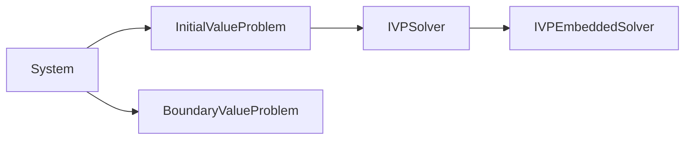

Desir is a library for solving differential equations in Rust.

This library is still very much a work in progress and may change
significnatly. No guarantees are made about the API stability.

The library is organised to separate the various aspects of differential
equations.

